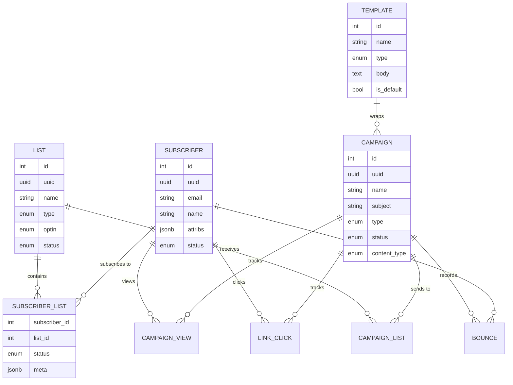

listmonk is built around four core concepts that work together to power your email campaigns. Understanding these concepts is essential for effective use of the platform.

## Overview

<CardGroup cols={4}>
  <Card title="Subscribers" icon="users" href="#subscribers">
    People who receive your campaigns
  </Card>
  <Card title="Lists" icon="list" href="#lists">
    Groups of subscribers organized by topic
  </Card>
  <Card title="Campaigns" icon="paper-plane" href="#campaigns">
    Email messages sent to lists
  </Card>
  <Card title="Templates" icon="palette" href="#templates">
    Reusable email layouts and designs
  </Card>
</CardGroup>

---

## Subscribers

Subscribers are individuals who receive your campaigns. Each subscriber has a unique email address and associated metadata.

### Subscriber Attributes

<AccordionGroup>
  <Accordion title="Basic Information" icon="user">
    Every subscriber has:

    - **UUID**: Unique identifier (auto-generated)
    - **Email**: Unique email address (required)
    - **Name**: Subscriber's name (required)
    - **Status**: Current status (enabled, disabled, or blocklisted)
    - **Created At**: Timestamp when subscriber was added
    - **Updated At**: Timestamp of last modification

    <CodeGroup>
    ```json Example Subscriber
    {
      "id": 1,
      "uuid": "5e91c497-b4b5-48d6-9548-e6b4f8e9d4c5",
      "email": "user@example.com",
      "name": "John Doe",
      "status": "enabled",
      "created_at": "2024-01-15T10:30:00Z",
      "updated_at": "2024-01-15T10:30:00Z"
    }
    ```
    </CodeGroup>
  </Accordion>

  <Accordion title="Custom Attributes" icon="tags">
    Subscribers can have custom attributes stored as JSON:

    <CodeGroup>
    ```json Custom Attributes Example
    {
      "email": "user@example.com",
      "name": "John Doe",
      "attribs": {
        "city": "New York",
        "country": "USA",
        "signup_source": "homepage",
        "plan": "premium",
        "interests": ["technology", "business"],
        "age": 35
      }
    }
    ```
    </CodeGroup>

    **Use Cases for Custom Attributes:**
    - Geographic targeting
    - Product/plan segmentation
    - Personalization in campaigns
    - Behavior tracking
    - Custom fields for your use case

    **Access in Templates:**
    ```go
    Hello from {{ .Subscriber.Attribs.city }}!
    Your {{ .Subscriber.Attribs.plan }} plan includes...
    ```
  </Accordion>

  <Accordion title="Subscriber Statuses" icon="circle-info">
    Subscribers have three possible statuses defined in `schema.sql:4`:

    <Tabs>
      <Tab title="Enabled">
        **Status**: `enabled`

        - Default status for active subscribers
        - Can receive all campaigns
        - Can manage their subscriptions
        - Can unsubscribe from lists

        <Info>
        This is the normal, active state for subscribers.
        </Info>
      </Tab>

      <Tab title="Disabled">
        **Status**: `disabled`

        - Temporarily inactive
        - Cannot receive campaigns
        - Subscription relationships preserved
        - Can be re-enabled later

        **When to use:**
        - Temporary suspension
        - Cooling-off period
        - Testing/debugging
        - Voluntary pause by subscriber
      </Tab>

      <Tab title="Blocklisted">
        **Status**: `blocklisted`

        - Permanently blocked from receiving emails
        - Cannot receive any campaigns
        - Usually result of hard bounces or complaints
        - Strongest form of opt-out

        <Warning>
        Blocklisted subscribers should never receive emails. This status is typically set automatically by bounce handling.
        </Warning>

        **Common reasons:**
        - Hard bounces (invalid email)
        - Spam complaints
        - Multiple soft bounces
        - Legal/compliance requirements
      </Tab>
    </Tabs>

    **Status Transitions:**

    ```mermaid
    graph LR
        A[Enabled] --> B[Disabled]
        B --> A
        A --> C[Blocklisted]
        B --> C
        C -.Cannot Return.-> A
    ```
  </Accordion>
</AccordionGroup>

### Subscription Management

Subscribers can be subscribed to multiple lists, each with its own subscription status.

<Accordion title="Subscription Statuses" icon="envelope">
  Defined in `schema.sql:5`, each subscriber-list relationship has one of three statuses:

  <Tabs>
    <Tab title="Unconfirmed">
      **Status**: `unconfirmed`

      - Subscriber has been added but not confirmed
      - Used with double opt-in lists
      - Subscriber receives confirmation email
      - Cannot receive regular campaigns until confirmed
      - Can receive opt-in confirmation campaigns

      **Workflow:**
      1. Subscriber signs up or is imported
      2. Status set to `unconfirmed`
      3. Confirmation email sent (if `send_optin_confirmation` enabled)
      4. Subscriber clicks confirmation link
      5. Status changes to `confirmed`

      <Info>
      Double opt-in is recommended for compliance with GDPR and best practices.
      </Info>
    </Tab>

    <Tab title="Confirmed">
      **Status**: `confirmed`

      - Subscriber has confirmed their subscription
      - Can receive campaigns sent to this list
      - Active subscription state
      - Subscriber can unsubscribe at any time

      **How subscribers get confirmed:**
      - Click confirmation link (double opt-in)
      - Immediate confirmation (single opt-in)
      - Admin manually confirms
      - API sets status to confirmed
    </Tab>

    <Tab title="Unsubscribed">
      **Status**: `unsubscribed`

      - Subscriber has opted out of this list
      - Cannot receive campaigns for this list
      - Subscription relationship preserved (for records)
      - Can re-subscribe later

      **Important:**
      - Unsubscribing from one list doesn't affect other lists
      - Subscriber can still receive campaigns from other subscribed lists
      - Different from subscriber status "blocklisted" (which blocks all emails)

      <Warning>
      Always honor unsubscribe requests immediately to comply with anti-spam laws.
      </Warning>
    </Tab>
  </Tabs>

  **Subscription Status Flow:**

  ```mermaid
  graph LR
      A[Unconfirmed] --> B[Confirmed]
      B --> C[Unsubscribed]
      C --> A
      A --> C
  ```
</Accordion>

---

## Lists

Lists are groups of subscribers organized by topic, interest, or purpose. Subscribers can belong to multiple lists simultaneously.

<AccordionGroup>
  <Accordion title="List Types" icon="layer-group">
    Defined in `schema.sql:1`, lists can be one of three types:

    <Tabs>
      <Tab title="Public">
        **Type**: `public`

        - Visible on the public subscription page
        - Subscribers can self-subscribe
        - Appears in public subscription forms
        - Used for newsletters, announcements, etc.

        **Example Use Cases:**
        - General newsletter
        - Product updates
        - Blog post notifications
        - Community announcements

        <CodeGroup>
        ```json Public List Example
        {
          "name": "Weekly Newsletter",
          "type": "public",
          "optin": "double",
          "description": "Our weekly newsletter with the latest updates",
          "tags": ["newsletter", "weekly"]
        }
        ```
        </CodeGroup>
      </Tab>

      <Tab title="Private">
        **Type**: `private`

        - Hidden from public subscription page
        - Only admins can add subscribers
        - Not visible in public forms
        - Used for internal or exclusive lists

        **Example Use Cases:**
        - VIP customers
        - Internal team communications
        - Beta testers
        - Exclusive offers
        - Partner communications

        <CodeGroup>
        ```json Private List Example
        {
          "name": "VIP Customers",
          "type": "private",
          "optin": "single",
          "description": "Exclusive list for VIP customers",
          "tags": ["vip", "premium"]
        }
        ```
        </CodeGroup>
      </Tab>

      <Tab title="Temporary">
        **Type**: `temporary`

        - Created for one-time campaigns
        - Automatically deleted after campaign completion
        - Used for ad-hoc segments
        - Not visible on public pages

        **Example Use Cases:**
        - One-time promotional campaigns
        - Event-specific communications
        - Temporary segments for testing
        - Campaign-specific targeting

        <Warning>
        Temporary lists and all their subscribers are automatically deleted after associated campaigns finish. Use with caution.
        </Warning>

        <CodeGroup>
        ```json Temporary List Example
        {
          "name": "Black Friday 2024 Segment",
          "type": "temporary",
          "optin": "single",
          "description": "Temporary list for Black Friday campaign",
          "tags": ["temporary", "promo"]
        }
        ```
        </CodeGroup>
      </Tab>
    </Tabs>
  </Accordion>

  <Accordion title="Opt-in Types" icon="envelope-circle-check">
    Defined in `schema.sql:2`, lists support two opt-in methods:

    <Tabs>
      <Tab title="Single Opt-in">
        **Type**: `single`

        - Subscribers are immediately confirmed
        - No confirmation email required
        - Faster subscription process
        - Higher conversion rate
        - Lower compliance confidence

        **When to use:**
        - Internal lists
        - Trusted sources
        - Low-risk communications
        - When speed matters more than verification

        **Workflow:**
        ```mermaid
        graph LR
            A[Subscribe] --> B[Confirmed]
        ```
      </Tab>

      <Tab title="Double Opt-in">
        **Type**: `double`

        - Subscribers must confirm via email
        - Sends confirmation email automatically
        - Verifies email address is valid
        - Better compliance (GDPR recommended)
        - Lower bounce rate

        **When to use:**
        - Public-facing lists
        - Compliance-critical scenarios
        - When list quality matters
        - GDPR compliance required

        **Workflow:**
        ```mermaid
        graph LR
            A[Subscribe] --> B[Unconfirmed]
            B --> C[Email Sent]
            C --> D[Click Link]
            D --> E[Confirmed]
        ```

        <Info>
        Double opt-in is the gold standard for email marketing compliance and list quality.
        </Info>
      </Tab>
    </Tabs>
  </Accordion>

  <Accordion title="List Status" icon="toggle-on">
    Defined in `schema.sql:3`, lists can have two statuses:

    <Tabs>
      <Tab title="Active">
        **Status**: `active`

        - List is operational and visible (based on type)
        - Can be used in campaigns
        - Accepts new subscribers
        - Normal operational state
      </Tab>

      <Tab title="Archived">
        **Status**: `archived`

        - List is hidden from active use
        - Cannot be used in new campaigns
        - Existing subscriptions preserved
        - Used for historical lists

        **When to archive:**
        - Discontinued newsletter
        - Completed event series
        - Seasonal campaigns (off-season)
        - Historical reference

        <Note>
        Archiving preserves data while removing the list from active use. You can unarchive lists later if needed.
        </Note>
      </Tab>
    </Tabs>
  </Accordion>

  <Accordion title="List Attributes" icon="list-check">
    Lists have several attributes for organization and configuration:

    <CodeGroup>
    ```json Complete List Structure
    {
      "id": 1,
      "uuid": "3e9c6a7f-8b2d-4e1a-9f3c-7d8e5a2b4c1f",
      "name": "Product Updates",
      "type": "public",
      "optin": "double",
      "status": "active",
      "tags": ["product", "updates", "monthly"],
      "description": "Monthly updates about new features and improvements",
      "created_at": "2024-01-01T00:00:00Z",
      "updated_at": "2024-01-15T10:30:00Z"
    }
    ```
    </CodeGroup>

    **Attributes:**
    - **UUID**: Unique identifier for external references
    - **Name**: Display name (required)
    - **Type**: public, private, or temporary
    - **Opt-in**: single or double
    - **Status**: active or archived
    - **Tags**: Array of strings for categorization
    - **Description**: Optional internal notes
  </Accordion>
</AccordionGroup>

---

## Campaigns

Campaigns are email messages sent to one or more lists. They are the primary way to communicate with your subscribers.

<AccordionGroup>
  <Accordion title="Campaign Lifecycle" icon="arrows-spin">
    Defined in `schema.sql:6`, campaigns progress through several statuses:

    <Steps>
      <Step title="Draft">
        **Status**: `draft`

        - Campaign is being created or edited
        - Not visible to subscribers
        - Can be freely modified
        - Not sending any messages

        **Actions available:**
        - Edit content
        - Change recipients
        - Configure settings
        - Send test emails
        - Schedule or start
      </Step>

      <Step title="Scheduled">
        **Status**: `scheduled`

        - Campaign is scheduled for future sending
        - Will automatically start at configured time
        - Can still be edited or cancelled
        - Shows scheduled time

        **Transitions to:**
        - `running` - At scheduled time
        - `draft` - If unscheduled
        - `cancelled` - If cancelled before start
      </Step>

      <Step title="Running">
        **Status**: `running`

        - Campaign is actively sending
        - Messages being delivered to subscribers
        - Progress tracked in real-time
        - Cannot be edited (content locked)

        **Monitoring:**
        - Sent count (current / total)
        - Error count
        - Real-time progress
        - Estimated completion time

        **Actions available:**
        - Pause
        - Cancel
        - View analytics
      </Step>

      <Step title="Paused">
        **Status**: `paused`

        - Campaign temporarily stopped
        - Can be resumed later
        - Progress saved
        - No messages sent while paused

        **Use cases:**
        - Emergency stop
        - Address issues
        - Rate limiting
        - Manual control

        **Actions available:**
        - Resume (returns to `running`)
        - Cancel
      </Step>

      <Step title="Cancelled">
        **Status**: `cancelled`

        - Campaign permanently stopped
        - Cannot be resumed
        - Partial send recorded
        - Final state (terminal)

        **When cancelled:**
        - Records show messages sent before cancellation
        - Remaining subscribers not contacted
        - Analytics available for sent portion
      </Step>

      <Step title="Finished">
        **Status**: `finished`

        - Campaign completed successfully
        - All messages sent
        - Final analytics available
        - Final state (terminal)

        **Available data:**
        - Total sent
        - Views (opens)
        - Clicks
        - Bounces
        - Completion time
      </Step>
    </Steps>

    **Status Flow Diagram:**

    ```mermaid
    graph TD
        A[Draft] --> B[Scheduled]
        A --> C[Running]
        B --> C
        C --> D[Paused]
        C --> E[Cancelled]
        C --> F[Finished]
        D --> C
        D --> E
        B --> A
    ```
  </Accordion>

  <Accordion title="Campaign Types" icon="envelopes-bulk">
    Defined in `schema.sql:7`, campaigns have two types:

    <Tabs>
      <Tab title="Regular">
        **Type**: `regular`

        - Standard marketing/newsletter campaigns
        - Sent to confirmed subscribers
        - Respects subscription preferences
        - Most common campaign type

        **Target subscribers with:**
        - Status: `enabled`
        - Subscription status: `confirmed`
        - On selected lists

        <CodeGroup>
        ```json Regular Campaign
        {
          "name": "Monthly Newsletter - March 2024",
          "type": "regular",
          "subject": "What's New This Month",
          "lists": [1, 2, 3],
          "template_id": 1
        }
        ```
        </CodeGroup>
      </Tab>

      <Tab title="Opt-in">
        **Type**: `optin`

        - Special campaign for opt-in confirmations
        - Sent to unconfirmed subscribers
        - Contains confirmation link
        - Triggered by double opt-in lists

        **Target subscribers with:**
        - Status: `enabled`
        - Subscription status: `unconfirmed`
        - On double opt-in lists

        <Info>
        Opt-in campaigns are typically automated and sent when subscribers join double opt-in lists.
        </Info>

        <CodeGroup>
        ```json Opt-in Campaign
        {
          "name": "Subscription Confirmation",
          "type": "optin",
          "subject": "Please confirm your subscription",
          "body": "Click here to confirm: {{ .OptinURL }}"
        }
        ```
        </CodeGroup>
      </Tab>
    </Tabs>
  </Accordion>

  <Accordion title="Content Types" icon="file-code">
    Defined in `schema.sql:8`, campaigns support multiple content formats:

    <Tabs>
      <Tab title="Rich Text">
        **Type**: `richtext`

        - Visual WYSIWYG editor
        - Easy formatting with toolbar
        - No coding required
        - Best for beginners
        - Automatically generates HTML

        **Features:**
        - Bold, italic, underline
        - Headings and paragraphs
        - Lists and links
        - Images
        - Basic styling
      </Tab>

      <Tab title="HTML">
        **Type**: `html`

        - Raw HTML code
        - Complete design control
        - Custom styling
        - Advanced layouts
        - Requires HTML knowledge

        **Best for:**
        - Custom designs
        - Complex layouts
        - Precise control
        - Developers
      </Tab>

      <Tab title="Plain Text">
        **Type**: `plain`

        - Plain text only
        - No formatting
        - Highest deliverability
        - Simple and direct
        - No HTML rendering

        **Advantages:**
        - Never caught by spam filters
        - Personal feel
        - Accessible
        - Fast to compose
      </Tab>

      <Tab title="Markdown">
        **Type**: `markdown`

        - Markdown syntax
        - Converted to HTML
        - Easy to write and read
        - Version control friendly
        - Balance of simplicity and features

        **Example:**
        ```markdown
        # Welcome!

        This is **bold** and this is *italic*.

        - Item 1
        - Item 2

        [Link text](https://example.com)
        ```
      </Tab>

      <Tab title="Visual">
        **Type**: `visual`

        - Drag-and-drop visual editor
        - Pre-built blocks
        - Responsive design
        - No coding needed
        - Professional layouts

        **Use cases:**
        - Professional newsletters
        - Marketing campaigns
        - Multi-section emails
        - Image-heavy content
      </Tab>
    </Tabs>
  </Accordion>

  <Accordion title="Campaign Attributes" icon="gear">
    Campaigns have comprehensive configuration options:

    <CodeGroup>
    ```json Complete Campaign Structure
    {
      "id": 1,
      "uuid": "7f3e9c6a-2d8b-1a4e-3c9f-5a7d8e2b4c1f",
      "name": "March Newsletter",
      "subject": "Spring Updates & New Features",
      "from_email": "newsletter@example.com",
      "body": "<html>Campaign content...</html>",
      "altbody": "Plain text version...",
      "content_type": "html",
      "type": "regular",
      "status": "finished",
      "tags": ["newsletter", "monthly"],
      "send_at": "2024-03-01T10:00:00Z",
      "template_id": 1,
      "messenger": "email",
      "lists": [1, 2],
      "to_send": 10000,
      "sent": 10000,
      "archive": true,
      "archive_slug": "march-2024-newsletter",
      "started_at": "2024-03-01T10:00:00Z",
      "created_at": "2024-02-28T15:00:00Z",
      "updated_at": "2024-03-01T11:30:00Z"
    }
    ```
    </CodeGroup>

    **Key Attributes:**
    - **name**: Internal reference name
    - **subject**: Email subject line (supports templates)
    - **from_email**: Sender email address
    - **body**: Campaign content (format depends on content_type)
    - **altbody**: Plain text alternative (optional)
    - **template_id**: Wrapper template to use
    - **lists**: Array of list IDs to send to
    - **send_at**: Scheduled send time (null for immediate)
    - **messenger**: Delivery method ("email" or custom)
    - **headers**: Custom email headers as JSON
    - **attribs**: Custom campaign attributes as JSON
    - **archive**: Publish to public archive
    - **archive_slug**: URL slug for archived campaign

    **Progress Tracking:**
    - **to_send**: Total subscribers to contact
    - **sent**: Messages successfully sent
    - **max_subscriber_id**: Highest subscriber ID in campaign
    - **last_subscriber_id**: Last processed subscriber ID
  </Accordion>

  <Accordion title="Campaign Analytics" icon="chart-line">
    listmonk tracks detailed analytics for each campaign:

    **Metrics Available:**

    <CardGroup cols={2}>
      <Card title="Delivery Metrics" icon="truck">
        - **To Send**: Total target audience
        - **Sent**: Successfully delivered
        - **Bounces**: Delivery failures
        - **Bounce Rate**: Percentage of bounces
      </Card>

      <Card title="Engagement Metrics" icon="chart-bar">
        - **Views**: Email opens (tracked via pixel)
        - **Open Rate**: Percentage who opened
        - **Clicks**: Link clicks
        - **Click Rate**: Percentage who clicked
        - **Click-to-Open Rate**: Clicks / Opens
      </Card>
    </CardGroup>

    **Analytics Tables:**

    From `schema.sql:156-166`:
    - **campaign_views**: Tracks individual email opens with timestamps
    - **link_clicks**: Tracks individual link clicks with subscriber and timestamp
    - **bounces**: Records bounce events with type and metadata

    **Dashboard Charts:**

    Materialized view `mat_dashboard_charts` (schema.sql:399-432) provides:
    - 30-day rolling link click trends
    - 30-day rolling campaign view trends
    - Aggregated by date for visualization

    <Info>
    Analytics data is retained even if subscribers are deleted, ensuring accurate historical reporting.
    </Info>
  </Accordion>
</AccordionGroup>

---

## Templates

Templates are reusable email layouts that wrap campaign content. They provide consistent branding and structure across all campaigns.

<AccordionGroup>
  <Accordion title="Template Types" icon="layer-group">
    Defined in `schema.sql:10`, templates have three types:

    <Tabs>
      <Tab title="Campaign">
        **Type**: `campaign`

        - Standard email templates
        - Wrap campaign content
        - Include header, footer, styling
        - Most common template type

        **Structure:**
        ```html
        <!DOCTYPE html>
        <html>
        <head>
          <style>
            /* Your branding styles */
          </style>
        </head>
        <body>
          <header>
            <!-- Logo, branding -->
          </header>
          
          <main>
            {{ template "content" . }}
          </main>
          
          <footer>
            <!-- Unsubscribe, contact info -->
            <a href="{{ .UnsubscribeURL }}">Unsubscribe</a>
          </footer>
        </body>
        </html>
        ```

        <Note>
        The `{{ template "content" . }}` directive inserts campaign content into the template.
        </Note>
      </Tab>

      <Tab title="Campaign Visual">
        **Type**: `campaign_visual`

        - Templates for visual editor
        - Support drag-and-drop blocks
        - Responsive design
        - Pre-defined sections

        **Features:**
        - Block-based layout
        - Mobile responsive
        - Pre-styled components
        - No coding required
      </Tab>

      <Tab title="Transaction">
        **Type**: `tx`

        - Transactional email templates
        - Used for system emails
        - Typically simpler design
        - Focused on information delivery

        **Use cases:**
        - Order confirmations
        - Password resets
        - Account notifications
        - System alerts
        - Subscription confirmations

        **Example:**
        ```html
        <!DOCTYPE html>
        <html>
        <body>
          <h1>{{ .Subject }}</h1>
          {{ template "content" . }}
          <p>This is an automated message.</p>
        </body>
        </html>
        ```
      </Tab>
    </Tabs>
  </Accordion>

  <Accordion title="Template Structure" icon="code">
    Templates use Go's template syntax for dynamic content:

    <CodeGroup>
    ```html Complete Template Example
    <!DOCTYPE html>
    <html>
    <head>
      <meta charset="utf-8">
      <meta name="viewport" content="width=device-width, initial-scale=1.0">
      <title>{{ .Subject }}</title>
      <style>
        body {
          font-family: Arial, sans-serif;
          line-height: 1.6;
          color: #333;
          max-width: 600px;
          margin: 0 auto;
          padding: 20px;
        }
        .header {
          background: #007bff;
          color: white;
          padding: 20px;
          text-align: center;
        }
        .content {
          padding: 20px;
          background: #f9f9f9;
        }
        .footer {
          padding: 20px;
          text-align: center;
          font-size: 12px;
          color: #666;
        }
        .button {
          display: inline-block;
          padding: 10px 20px;
          background: #007bff;
          color: white;
          text-decoration: none;
          border-radius: 4px;
        }
      </style>
    </head>
    <body>
      <div class="header">
        <h1>Your Company Name</h1>
      </div>
      
      <div class="content">
        {{ template "content" . }}
      </div>
      
      <div class="footer">
        <p>
          You're receiving this email because you subscribed to our mailing list.
        </p>
        <p>
          <a href="{{ .UnsubscribeURL }}">Unsubscribe</a> | 
          <a href="{{ .OptinURL }}">Manage Preferences</a> | 
          <a href="{{ .MessageURL }}">View in Browser</a>
        </p>
        <p>
          Company Name<br>
          123 Main St, City, State 12345<br>
          © {{ .Date.Year }} All rights reserved
        </p>
      </div>
    </body>
    </html>
    ```
    </CodeGroup>

    **Template Variables:**

    listmonk provides these variables in all templates:

    <Tabs>
      <Tab title="Campaign Variables">
        - `{{ .Subject }}` - Campaign subject
        - `{{ .FromEmail }}` - Sender email
        - `{{ .Date }}` - Current date/time
        - `{{ .Campaign.Name }}` - Campaign name
        - `{{ .Campaign.UUID }}` - Campaign UUID
        - `{{ .Campaign.Tags }}` - Campaign tags
      </Tab>

      <Tab title="Subscriber Variables">
        - `{{ .Subscriber.UUID }}` - Subscriber UUID
        - `{{ .Subscriber.Email }}` - Email address
        - `{{ .Subscriber.Name }}` - Full name
        - `{{ .Subscriber.FirstName }}` - First name
        - `{{ .Subscriber.LastName }}` - Last name
        - `{{ .Subscriber.Status }}` - Subscriber status
        - `{{ .Subscriber.Attribs.key }}` - Custom attributes
      </Tab>

      <Tab title="URL Variables">
        - `{{ .UnsubscribeURL }}` - Unsubscribe link
        - `{{ .OptinURL }}` - Manage preferences
        - `{{ .MessageURL }}` - View in browser
        - `{{ .TrackingPixelURL }}` - Open tracking pixel
        - `{{ .ArchiveURL }}` - Public archive link
      </Tab>
    </Tabs>

    **Template Functions:**

    ```html
    <!-- Date formatting -->
    {{ .Date.Format "January 2, 2006" }}

    <!-- Conditionals -->
    {{ if .Subscriber.Attribs.city }}
      Hello from {{ .Subscriber.Attribs.city }}!
    {{ end }}

    <!-- Loops -->
    {{ range .Campaign.Tags }}
      <span class="tag">{{ . }}</span>
    {{ end }}

    <!-- String functions -->
    {{ .Subscriber.Email | lower }}
    {{ .Subscriber.Name | upper }}
    ```
  </Accordion>

  <Accordion title="Default Template" icon="star">
    Every listmonk installation can have one default template (schema.sql:85):

    ```sql
    is_default BOOLEAN NOT NULL DEFAULT false
    CREATE UNIQUE INDEX ON templates (is_default) WHERE is_default = true;
    ```

    **Default Template Behavior:**
    - Used when no template explicitly selected
    - Only one template can be default
    - Ensures consistent branding
    - Can be changed anytime

    **Setting Default Template:**
    1. Navigate to Settings → Templates
    2. Edit desired template
    3. Check "Set as default"
    4. Save

    <Info>
    The default template is automatically applied to new campaigns unless you choose a different template.
    </Info>
  </Accordion>

  <Accordion title="Template Best Practices" icon="lightbulb">
    <Steps>
      <Step title="Keep It Responsive">
        Ensure templates work on all devices:

        ```html
        <meta name="viewport" content="width=device-width, initial-scale=1.0">
        
        <style>
          @media only screen and (max-width: 600px) {
            .content {
              padding: 10px !important;
            }
            .button {
              display: block !important;
              width: 100% !important;
            }
          }
        </style>
        ```
      </Step>

      <Step title="Include Required Links">
        Always include:
        - Unsubscribe link (often required by law)
        - Physical mailing address (CAN-SPAM requirement)
        - Preference management link
        - View in browser link

        <Warning>
        Failure to include an unsubscribe link violates anti-spam laws in most jurisdictions.
        </Warning>
      </Step>

      <Step title="Optimize for Email Clients">
        - Use table-based layouts for better compatibility
        - Inline CSS for older clients
        - Test in multiple email clients
        - Provide plain text alternative
        - Keep width ≤ 600px
      </Step>

      <Step title="Brand Consistency">
        - Use your brand colors
        - Include logo
        - Consistent typography
        - Match website design
        - Professional footer
      </Step>

      <Step title="Performance">
        - Optimize images
        - Keep HTML size reasonable
        - Minimize external resources
        - Use web-safe fonts as fallback
      </Step>
    </Steps>
  </Accordion>
</AccordionGroup>

---

## Relationships

Understanding how these concepts relate to each other:



## Summary

<CardGroup cols={2}>
  <Card title="Subscribers" icon="users">
    **Statuses**: enabled, disabled, blocklisted
    
    **Subscription Statuses**: unconfirmed, confirmed, unsubscribed
    
    **Features**: Custom JSONB attributes, multiple list subscriptions
  </Card>
  
  <Card title="Lists" icon="list">
    **Types**: public, private, temporary
    
    **Opt-in**: single, double
    
    **Status**: active, archived
  </Card>
  
  <Card title="Campaigns" icon="paper-plane">
    **Statuses**: draft, scheduled, running, paused, cancelled, finished
    
    **Types**: regular, optin
    
    **Content**: richtext, html, plain, markdown, visual
  </Card>
  
  <Card title="Templates" icon="palette">
    **Types**: campaign, campaign_visual, tx
    
    **Features**: Go template syntax, variables, functions, default template support
  </Card>
</CardGroup>

---

## Next Steps

<CardGroup cols={3}>
  <Card title="Templates Guide" icon="palette" href="/features/templates">
    Create custom email templates
  </Card>
  
  <Card title="Campaign Management" icon="paper-plane" href="/features/campaigns">
    Learn advanced campaign features
  </Card>
  
  <Card title="Subscriber Management" icon="users" href="/features/subscribers">
    Import, segment, and manage subscribers
  </Card>
  
  <Card title="Analytics" icon="chart-bar" href="/features/campaigns">
    Track campaign performance
  </Card>
  
  <Card title="API Reference" icon="code" href="/api/overview">
    Automate with the REST API
  </Card>
  
  <Card title="Bounce Handling" icon="envelope-circle-check" href="/advanced/bounces">
    Configure automatic bounce processing
  </Card>
</CardGroup>