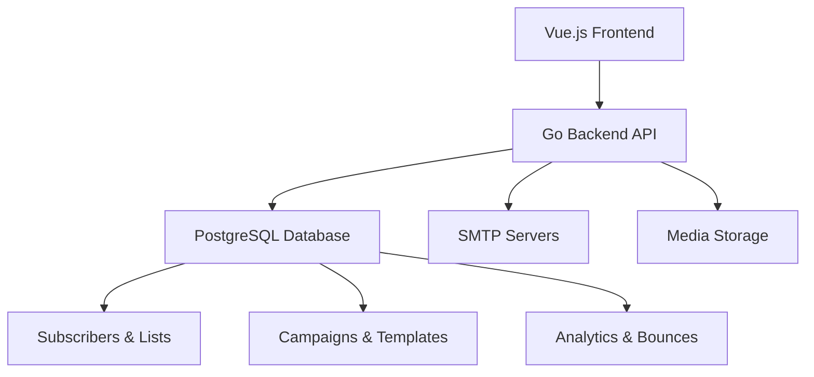

## What is listmonk?

listmonk is a standalone, self-hosted, newsletter and mailing list manager. It is fast, feature-rich, and packed into a single binary. It uses a PostgreSQL database as its data store.

<Info>
listmonk is free and open source software licensed under **AGPLv3**.
</Info>

Visit [listmonk.app](https://listmonk.app) for more information or check out the [live demo](https://demo.listmonk.app).

## Key Features

<CardGroup cols={2}>
  <Card title="High Performance" icon="gauge-high">
    Built with Go for exceptional speed and efficiency. Handles large subscriber bases with ease through optimized database queries and batch processing.
  </Card>
  
  <Card title="Self-Hosted" icon="server">
    Complete control over your data and infrastructure. No third-party dependencies or per-subscriber pricing.
  </Card>
  
  <Card title="Feature-Rich" icon="sparkles">
    Comprehensive campaign management, template engine, media library, analytics, bounce handling, and more.
  </Card>
  
  <Card title="Single Binary" icon="cube">
    Entire application packed into one executable with no external dependencies except PostgreSQL.
  </Card>
</CardGroup>

## Architecture Overview

listmonk is built with modern, battle-tested technologies:

<Steps>
  <Step title="Backend - Go">
    The backend is written in **Go**, providing high performance, concurrency, and reliability. The application compiles to a single binary for easy deployment.
  </Step>
  
  <Step title="Frontend - Vue.js">
    The admin interface is built with **Vue.js** and **Buefy** for a modern, responsive user experience.
  </Step>
  
  <Step title="Database - PostgreSQL">
    **PostgreSQL** serves as the data store, providing robust data integrity, ACID compliance, and advanced querying capabilities including JSONB support for flexible metadata storage.
  </Step>
</Steps>

### System Design

## Core Capabilities

### Campaign Management
- **Multiple Campaign Types**: Regular campaigns and opt-in confirmation campaigns
- **Campaign Statuses**: Draft, scheduled, running, paused, cancelled, and finished
- **Content Types**: Rich text, HTML, plain text, markdown, and visual editor
- **Scheduling**: Schedule campaigns for future delivery
- **Template Engine**: Reusable templates with variable interpolation

### Subscriber Management
- **Flexible Attributes**: Store custom subscriber data as JSONB
- **Status Management**: Enabled, disabled, and blocklisted subscribers
- **Subscription Tracking**: Unconfirmed, confirmed, and unsubscribed states
- **Bulk Operations**: Import, export, and manage subscribers at scale

### List Management
- **List Types**: Public, private, and temporary lists
- **Opt-in Options**: Single and double opt-in support
- **List Statuses**: Active and archived lists
- **Segmentation**: Tag-based organization and filtering

### Analytics & Tracking
- **Campaign Views**: Track email opens and engagement
- **Link Clicks**: Monitor click-through rates on campaign links
- **Bounce Handling**: Automatic processing of soft bounces, hard bounces, and complaints
- **Dashboard Stats**: Real-time statistics and 30-day trend charts

### Advanced Features
- **Media Library**: Upload and manage campaign media assets
- **Multiple SMTP Servers**: Configure multiple SMTP providers with fallback
- **Webhook Support**: Integrate with external bounce handling services (SES, SendGrid, Postmark)
- **Public Archive**: Optional public archive of sent campaigns with RSS feeds
- **User Management**: Multi-user support with role-based permissions
- **Two-Factor Authentication**: TOTP-based 2FA for enhanced security
- **API Access**: Full REST API for programmatic access

## Use Cases

listmonk is ideal for:

<AccordionGroup>
  <Accordion title="Newsletter Publishers">
    Send newsletters to your audience with rich content, media attachments, and detailed analytics. Perfect for bloggers, content creators, and media organizations.
  </Accordion>
  
  <Accordion title="Product Updates">
    Keep customers informed about product releases, feature updates, and company news. Segment audiences based on product interest or usage.
  </Accordion>
  
  <Accordion title="Marketing Campaigns">
    Run targeted marketing campaigns with A/B testing capabilities, detailed tracking, and bounce management. Scale from hundreds to millions of subscribers.
  </Accordion>
  
  <Accordion title="Community Engagement">
    Build and engage communities with regular updates, event notifications, and announcements. Support both public and private mailing lists.
  </Accordion>
  
  <Accordion title="Transactional Emails">
    Send transactional emails using dedicated templates (tx type) for order confirmations, password resets, and notifications.
  </Accordion>
  
  <Accordion title="Internal Communications">
    Manage internal company communications, department newsletters, and employee announcements with private lists.
  </Accordion>
</AccordionGroup>

## Performance & Scalability

<CardGroup cols={3}>
  <Card title="High Throughput" icon="rocket">
    Configurable concurrency and message rate for optimal sending speed based on your infrastructure.
  </Card>
  
  <Card title="Batch Processing" icon="layer-group">
    Process subscribers in configurable batches (default 1000) for memory efficiency.
  </Card>
  
  <Card title="Rate Limiting" icon="gauge">
    Built-in rate limiting with sliding window support to comply with SMTP provider limits.
  </Card>
</CardGroup>

Default performance settings from `schema.sql:236-241`:
- **Concurrency**: 10 concurrent workers
- **Message Rate**: 10 messages per second
- **Batch Size**: 1000 subscribers per batch
- **Sliding Window**: Optional rate limiting over custom duration

## Privacy & Compliance

listmonk includes comprehensive privacy features:

- **Individual Tracking Control**: Disable tracking per subscriber
- **Unsubscribe Headers**: Automatic List-Unsubscribe headers
- **Data Export**: Allow subscribers to export their data
- **Data Wipe**: Allow subscribers to request data deletion
- **Blocklist Management**: Configurable domain blocklist and allowlist
- **Opt-in IP Recording**: Optional IP address recording for compliance
- **CAPTCHA Support**: hCaptcha and AltCha integration for form protection

## Open Source & Community

<Note>
listmonk is developed and maintained by [Zerodha](https://zerodha.tech), India's largest stock broker, and is used to send millions of emails to their user base.
</Note>

As an open source project under the **AGPL-3.0 license**, listmonk benefits from:

- **Active Development**: Regular updates and new features
- **Community Contributions**: Bug fixes, translations, and enhancements from the community
- **Transparency**: Full visibility into the codebase and operations
- **No Vendor Lock-in**: Self-hosted with complete control over your data

## Next Steps

<CardGroup cols={2}>
  <Card title="Installation" icon="download" href="/installation">
    Get listmonk installed using Docker or binary installation
  </Card>
  
  <Card title="Quick Start" icon="play" href="/quickstart">
    Send your first campaign in under 5 minutes
  </Card>
  
  <Card title="Core Concepts" icon="book" href="/concepts">
    Learn about subscribers, lists, campaigns, and templates
  </Card>
  
  <Card title="Configuration" icon="gear" href="/configuration">
    Configure listmonk for your environment
  </Card>
</CardGroup>